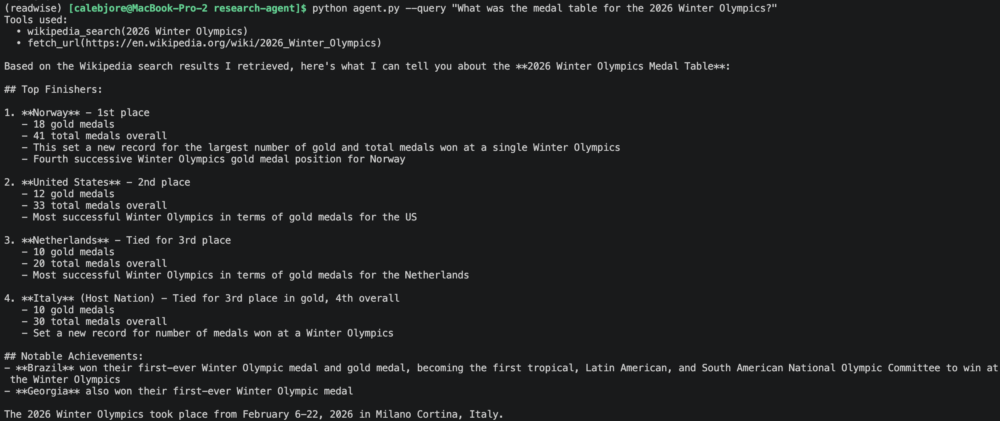

## Structure:

research-agent/
├── agent.py          # entry point, argparse, asyncio.run()
├── llm_client.py     # wraps the Anthropic API call
├── tools.py          # the three tool implementations
├── graph.py          # LangGraph setup
├── prompts.py        # system prompt
└── README.md         # written at the end

## Example query
